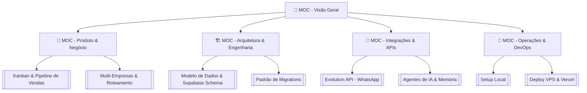

# 📌 MOC - Visão Geral do App Its Time (CRM de Óticas)

Bem-vindo ao **Map of Content (MOC) Principal** da documentação do **Its Time**. Este documento funciona como o índice central de conhecimento do aplicativo no Obsidian, conectando módulos de produto, arquitetura técnica, integrações, DevOps e manuais operacionais.

---

## 🧭 Navegação Rápida pelos MOCs Principais

---

## 🗂️ Pilares da Documentação

### 1. 🎯 [[🎯 MOC - Produto & Negócio]]
- [[Visão Geral do Sistema (CRM Óticas)]]: Contexto de negócio, nicho de atuação e objetivos da plataforma.
- [[Regras de Negócio & Workflows]]: Regras operacionais de leads, orçamentos, vendas e atendimento.
- [[Perfis de Acesso & Permissões (Roles)]]: Permissões de Admin, Gerente e Vendedor.
- **Módulos do Sistema**:
  - [[Kanban & Pipeline de Vendas]]: Estágios, cores Notion-style, drag & drop, automações de status.
  - [[Gestão Multi-Empresas & Encaminhamento Inteligente]]: Multi-tenancy por filiais/empresas e atribuição inteligente de atendimento.
  - [[Agenda & Agendamentos]]: Controle de exames de vista, consultas e retornos de clientes.
  - [[Agentes de IA & Automações]]: Respostas automáticas, classificação de leads e acompanhamento.

---

### 2. 🏗️ [[🏗️ MOC - Arquitetura & Engenharia]]
- [[Visão Geral da Arquitetura (System Overview)]]: Diagrama da arquitetura Frontend (React/Vite) + Backend (Supabase + VPS Node.js).
- [[Modelo de Dados & Schema Supabase]]: Schemas relacionais, tabelas (`leads`, `empresas`, `users`, `automations`, `agendamentos`).
- [[Políticas de RLS & Segurança]]: Row Level Security no Supabase para isolamento multi-tenant por empresa.
- [[Estrutura do Frontend (React + Vite + TS)]]: Organização de pastas (`src/components`, `src/hooks`, `src/services`).
- [[Padronização de Migrations & Schema Preflight]]: Regras estritas de validação de schema antes do deploy.

---

### 3. 🔌 [[🔌 MOC - Integrações & APIs]]
- [[Evolution API (WhatsApp)]]: Conexão com instâncias do WhatsApp Web, envio e recebimento de mensagens.
- [[Meta API & Gupshup]]: Integração oficial da Meta Cloud API e mensageria empresarial.
- [[Motores de IA & Contexto-Memória]]: Prompts de IA, retenção de histórico de conversas e ferramentas (Tools).
- [[Eventos Async & Redis Queue]]: Filas de background (BullMQ/Redis) para retentativas de webhooks.

---

### 4. 🎨 [[🎨 Design System & UI-UX]]
- [[Identidade Visual & Paleta de Cores (#C9A66B)]]: Guia visual, tons de dourado, backgrounds escuros (`#161616`, `#1E1E1E`).
- [[Biblioteca de Componentes UI]]: Shadcn/UI, Tailwind CSS, modais, drawers e toasts.
- [[Guia de UX, Atalhos & Acessibilidade]]: Navegação por teclado (`Ctrl+K`, `N`, `M`), navegação ARIA e microinterações.

---

### 5. 🚀 [[🚀 MOC - Operações & Deploy]]
- [[Setup do Ambiente Local]]: Como rodar `npm run dev`, `npx supabase start` e Docker Compose local.
- [[Deploy VPS & Docker Stack]]: Configuração do Docker Swarm/Compose no servidor VPS.
- [[Deploy Vercel (Frontend)]]: Build e variáveis de produção no Vercel.
- [[Variáveis de Ambiente & Secrets]]: Guia de preenchimento dos arquivos `.env.local` e `.env.vps.local`.

---

### 6. 📖 [[📖 Manuais & Procedimentos (SOPs)]]
- [[Guia de Onboarding de Nova Ótica]]: Passo a passo para cadastrar uma nova empresa e configurar números de WhatsApp.
- [[Troubleshooting & Resolução de Erros Comuns]]: Diagnóstico para falha de preflight, WhatsApp desconectado e bloqueio de RLS.
- [[Guia de Contribuição de Código]]: Convenções de Git, mensagens de commit e code review.

---

## 📈 Tabela Dinâmica de Documentos Principais

| Documento | Pilar | Status | Código Relacionado |
| :--- | :--- | :--- | :--- |
| [[Visão Geral do Sistema (CRM Óticas)]] | Produto | ✅ Aprovado | `src/App.tsx` |
| [[Kanban & Pipeline de Vendas]] | Produto | ✅ Aprovado | `src/components/kanban/` |
| [[Gestão Multi-Empresas & Encaminhamento Inteligente]] | Produto | ✅ Aprovado | `update/especificacao_empresas_e_encaminhamento_inteligente.md` |
| [[Modelo de Dados & Schema Supabase]] | Arquitetura | ✅ Aprovado | `supabase/migrations/` |
| [[Evolution API (WhatsApp)]] | Integrações | ✅ Aprovado | `docker-compose.evolution.yml` |
| [[Identidade Visual & Paleta de Cores (#C9A66B)]] | UI/UX | ✅ Aprovado | `tailwind.config.ts` |
| [[Setup do Ambiente Local]] | DevOps | ✅ Aprovado | `start-dev.ps1` |

---
*Documentação gerada e mantida em sincronia com o repositório **Its Time**.*
