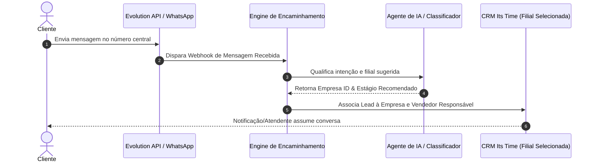

# 🏬 Gestão Multi-Empresas & Encaminhamento Inteligente

A arquitetura do **Its Time** permite gerenciar múltiplas óticas/filiais em uma única instância do sistema, mantendo o isolamento de dados entre empresas e oferecendo roteamento inteligente de mensagens de entrada.

---

## 🔄 Fluxo de Encaminhamento Inteligente

---

## 🛡️ Regras de Isolamento Multi-Tenancy (RLS)

1. **Atendente / Vendedor**: Possui visibilidade estrita aos leads e orçamentos vinculados à sua `empresa_id` cadastrada.
2. **Gerente de Filial**: Visualiza relatórios e kanban de toda a sua filial.
3. **Admin Geral**: Possui visão global, podendo alternar o contexto de visualização entre filiais ou visualizar o consolidador multi-empresas.

---

## 🔗 Links Relacionados
- [[🎯 MOC - Produto & Negócio]]
- [[Modelo de Dados & Schema Supabase]]
- [[Políticas de RLS & Segurança]]
